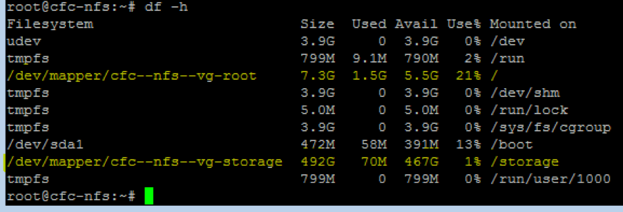
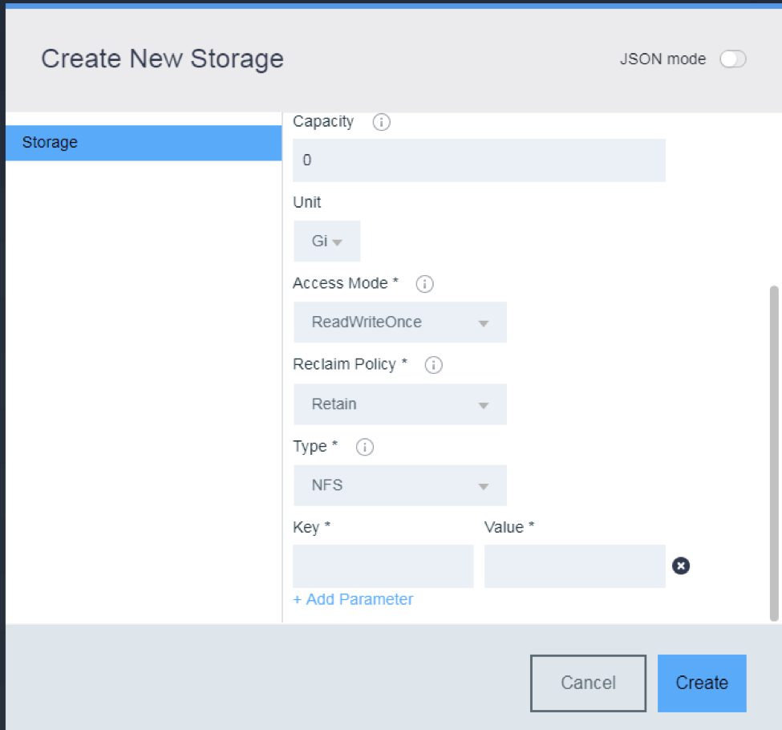
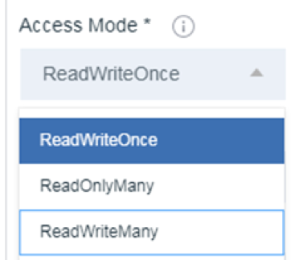
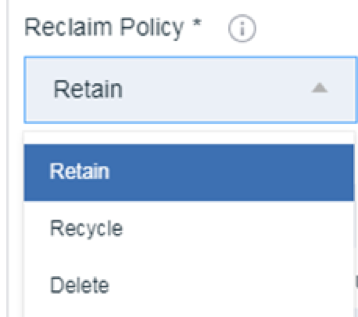
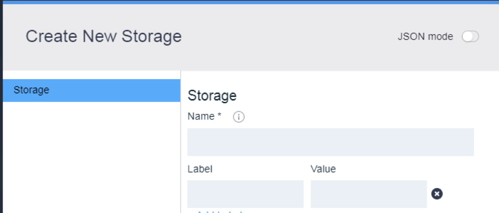
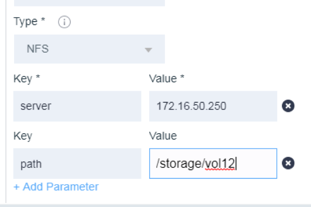

IBM Spectrum Conductor for Containers
=====================================

Storage Best Practices
----------------------

If you are used to the terminology used in the Kubernetes documentation,
terminology for IBM Spectrum Conductor for Containers (CFC )is a bit
different. In Kubernetes a PersistentVolume (PV) is a definition of
available storage for the entire cluster and a PersistentVolumeClaim
(PVC) is a specific application’s claim to some of that storage.

The equivalent to a PV in CFC is “Storage” and the equivalent of a PVC
is a “Volume”. So, a Storage object is available to the entire cluster
and a volume is used by an application to store data. This document may
use these terms interchangeably depending on the context.

CFC provides for three types of storage: HostPath (experimental at the
time of this writing), NFS, and Glusterfs.

> **HostPath** will provide you access to a location on the compute node
> running the container. For certain containers this could be helpful,
> but keep reading so see potential catastrophic consequences of this.
>
> **NFS** will be the most common and is pretty easy to setup.
>
> **Glusterfs** is an opensource networked filesystem.

In this document, we will concentrate on NFS.

For this example we will setup an NFS filesystem on an Ubuntu 16.04
virtual machine to use for our storage.

First, install an ubuntu basic server with openssh server and give it a
static IP address.

The disk on your VM should be large enough to handle however much
storage you want to provide to your cluster.

It is good practice to create a separate logical volume for the
filesystem you will share so that you do not fill up your root
filesystem with storage files (ubuntu likes to create a single large
root filesystem for everything).

There are a number of ways to do this. In this example, I used a small
disk for root (8GB) and a second larger disk for the storage volume. See
Appendix A for step-by-step instructions on how to create an NFS server
on ubuntu for use with CFC.

For reasons which will be discussed later, it is highly recommended that
the disks used for NFS storage be thinly provisioned.

 

There are a number of ways to configure storage in CFC and how you use
your NFS server will depend upon your application’s storage needs and
there are some caveats. Lets create some storage in CFC and walk through
the options.

Login to the CFC console as admin (the default password is admin) and
click on the menu icon at the top left, then on Infrastructure and
Storage:

 

Next click on the Storage tab (it should already be selected), and then
click the “Create Storage” button.

 

For now, lets scroll down to the bottom and look at our options:

 

The important bits here are Capacity, Access Mode, and Reclaim Policy
and we will discuss these in a lot more detail.

All storage (aka PV) in CFC is global. That means that any volume (aka
PVC) can bind to any storage that satisfies the request. The inclination
is just to create some big storage and let users claim as much of it as
they need, but it doesn’t work that way in CFC.

When a user requests a new volume, he/she will specify the type of
storage they want and CFC will find the next available storage that
satisfies the request and will bind it. What happens next depends on the
vlaues of Access Mode and Reclaim Policy.

CFC will allow overprovisioning of storage. This means that even if your
remote storage has only 50Gi available, you can still provision 100Gi of
space to storage. This is normally okay (and even good) so long as you
keep an eye on storage utilization on your NFS server.

The volume claims don’t actually reserve that amount of storage on the
NFS server, they are just only allowed to use the amount they claim. If
the application claims 20BGi of storage, but only writes 100Mb to disk,
only 100Mb of the NFS storage is used.

If the NFS Virtual Machine is also thinly provisioned then this
mechanism can be much more efficient that it would seem on the surface.

The rule of thumb for most virtualization is that storage can be
overpovisoned by an average of 4:1. This, of course, is just a rule of
thumb and will vary depending on the workloads.

 

**ReadWriteOnce** (abbreviated RWO in the storage table) means that only
a single volume can use the storage at a time and that volume has
ReadWrite access. Once a volume is bound to a storage with this Access
Mode, it is unusable to any other volume until that volume is destroyed
and its clam is released.

 

Since these are ReadWriteOnce storage, If you create storage with a 50Gi
capacity and the volume is only asking for 1Gi, but the only available
storage is 50Gi, that 50Gi storage will be bound to the volume and all
that extra capacity will not be used which wastes 49Gi of storage for
the duration of the claim.

Best practice is to create various volumes of differnet sizes so that
any volumes can bind to storage which is closest to what it needs.

This will be the most commonly used storage access mode.

**ReadOnlyMany** (abbreviated ROX in the table) means that many
different volumes can use the storage at one time, but they cannot write
to it. This would be analogous to a CD/DVD and would be useful to
provide common data to a large number of users, but the users are not
able to modify it.

**ReadWriteMany** (abbreviated RWX in the table) will allow many
different volumes to bind to it simulataneously and all may read write
at the same time. This can be dangerous since if two different
applications are writing the same file at the same time, one will
overwrite the other. If this method is used, it should be used
cautiously with collaboration between the users such that no data
overlaps or can inadvertently affect other applications’ data.

The usefulness of this Access Mode is where there is a common dataset
used by more than one application – for instance where one application
is writing data and another is reading that data.

The next important parameter is the Reclaim Policy and for this, you
have three options: Retain, Recycle, and Delete.

 

**Retain** means that when the volume has finished using the storage, it
leaves all the data it created on the storage and someone will have to
manually clean it up later. This could be useful for a number of reasons
including making sure generated data is backed up before it is deleted,
having common data that can be used by many subsequent volumes, etc.
Just be aware, that any subsequent binding has the potential to
overwrite anything already there and if it is released and rebound, any
volume newly bound will have access to the data that is there, so there
are also security implications.

**Recycle** \[DANGER\] means that when a volume is done using this
storage it will do an “rm -rf” on the root of the filesystem to clean up
after itself. If you are using HostPath and point it to / and then set
the storage Reclaim Policy to “Recycle” then once the volume releases
its claim, the storage will wipe the hard drive of the worker node on
which it is running.

Furthermore, if you are using an access mode of ReadWriteMany and a
Reclaim Policy of Recycle, then when any of the volumes with a claim on
the storage gives up its claim the entire storage will be wiped and all
other tenants will lose their data.

Probably the only situation where it is appropriate to use Recycle is
with the ReadWriteOnce access method. In this case, this storage is only
used by one tenant at a time and when they are done with it, it is wiped
and made available for use by another tenant.

Any tenant using this type of Reclaim Policy should be aware that when
they release their volume all their data will be lost.

Now lets scroll back to the top and have a look at those parameters.

 

**Name** can be any unique name that complies with the naming
guildelines. Importantly, volumes do not ask for storage by name. They
specify the type of storage they need and CFC will find any available
storage that meets that need and will bind it. This name is primarily
for the system administrator to be able to easily identify what kind of
storage this is. There are limits on the characters that can be used as
a storage name and if you type an invalid name it will tell you what was
wrong and give you the requirements.

**Label** and **Value** are used to clarify what what kind of storage
this is and a volume can specify that it shoiuld only bind to storage
with a specific value for a specific label. This can be useful if there
is dedicated storage for a particular project. Any namespace in that
project can specify that the volume be assigned based on some value
specified here.

The last part of creating storage is specifying the NFS server
information.

 

First, set the storage type as NFS.

Then you must add two key/value pairs to identify the NFS server to use.

The first key should be named “server” and its value is the IP address
or hostname of your NFS server.

The second key is “Path” and its value is the path on the NFS server
where this storage should keep its files.

The initial inclination would be to create multiple NFS exports from the
NFS server and then mount each of these and expose them to external
servers. This, however, would quickly become and administrative
nightmare as the number of storage allocations grows.

For this reason, in this example, we expose a single NFS mount from the
server and then create as many subdirectories in that location as we
need and then provide those subdirectories as the mount points for our
CFC defined storage.

In the example above, the NFS server is exposing /storage as a mount
point. Under this directory we created a “vol12” subdirectory and this
is the full path that we use as the mount path for this particular
storage.

Using this method, when a volume has requested a reclaim policy of
“recycle” only the files under that subdirectory are wiped.

When using storage this way, all CFC storage are sharing the common
capacity of the mounted NFS volume. So if /storage is a 500GB disk with
five subdirectories, each of the five could potentially have up to 500GB
of space, not to exceed 500GB total combined space on the disk.

On the CFC dashboard, then, you can see at-a-glance exactly how much
storage you have provisioned as well as how much has been allocated and
how much is availble.

{width="4.111111111111111in" height="1.75in"}

In this case, we have provisioned a total of 180GiB of storage. Volumes
are using 50GiB of that storage , 50GiB has been used and then released,
and 80GiB remains unused and available.

When the amount of available space gets low, the amount of shared
storage can be expanded in a number of ways.

Frirst, if the amont of available storage is low in the dashboard, but
the amount of space actually used on the NFS filesystem is low, then the
NFS storage is being underutiliized and it can be more efficiently
utilized by a higher rate of overprovisioning.

For instance, lets assume you have a 180GB NFS volume and you have
allocated 100% of the space to storate in CFC. The dashboard may show
something similar to what you see above. If the dashboard shows 1GiB
available and 179GiB utilized then you would go to your nfs server and
look at the actual amount of space used on the disk.

Run the “df -h” command on the storage server and look at the results.
If you find that the NFS mount point is only 50% utilized then you can
probably safely overprovision this resource by 30% or more with no
problem. In that case, you can create additional subdirectories under
/storage on the NFS server and them mount those as storage in CFC such
that you are 130% (or more) provisioned.

Depending on your users’ habits and workloads, you may be able to
overprovision as much as 400%.

If the existing server shows the actual NFS mount to be highly utilized,
then you could also add additional capacity with no downtime by either
adding an additional virtual disk to the VM or by expanding the existing
disk. Instructions for doing this is beyond the scope of this document.

You can also add an additional NFS server with additional capacity and
just change the server key/value pair when adding storage from this
server.

Which option you choose will depend on your situation and business
policies.

Appendix A

Creating an NFS server on Ubuntu for use as a external storage with CFC
-----------------------------------------------------------------------

### Adding a new storage disk to an existing virtual machine

For this example, I first created a virtual machine for use as an NFS
server and installed Ubuntu 16.04.2 server onto a small (8GB) virtual
disk (thinly provisioned). I used one vCPU and 2GB of RAM. I installed
only the basic server and openssh server packages. I chose to have
Ubuntu create the default filesystem using LVM. This will create a
volume group and logical volumes for swap and root only.

I then shut the VM down, added a second 500GB virtual disk (thinly
provisioned) to be used for the storage volume and booted it back up. I
then used lvm to create a separate logical volume for the NFS storage.

I could have added all the storage I wanted when I created the virtual
machine and used the OS installer to configure the partitions, but since
we want this VM to run as lean as possible we used on the basic server
package and thus do not have an LVM UI available if we need to add
addition disks or expand existing disks at a later time. By adding the
second disk after the initial install, I am able to document the way to
do this if you need to do so in the future.

The first disk (used for the root filesystem) will be /dev/sda, the
second disk will be /dev/sdb. The first partition on /dev/sda is
/dev/sda1, the second partition is /dev/sda2, etc.

Executing ‘ls /dev/sd\*’ will show you what disks you have available.
You should see /dev/sda, /dev/sda1, and a couple oif others beginning
with /dev/sda, and /dev/sdb. /dev/sdb will be your second 500GB disk.
There is no /dev/sdb1 because this disk does not currently have any
partition.

{width="4.513888888888889in"
height="0.5694444444444444in"}

We will use sudo to get a root shell so we don’t have to type “sudo” a
million times.

> sudo su - \# Get a root shell

We then need to create a partition on the newly installed disk.

> fdisk /dev/sdb \# Create a partition on my new drive

Use the “p” command to display existing partitions. There will be none
since this is a newly provisioned virtual disk.

> Type “n” to create a new primary partition and accept all the defaults
> to create a partition that utilizes the entire disk.
>
> Type “w” to write the partition information to the disk.

{width="6.763888888888889in"
height="2.9444444444444446in"}

> ls /dev/sd\* \# You should now see /dev/sdb1 listed

{width="5.277777777777778in"
height="0.5277777777777778in"}

> pvcreate /dev/sdb1 \# Create a new physical volume for lvm

{width="4.291666666666667in"
height="0.5694444444444444in"}

> pvs \# You should see /dev/sdb1 in the list. Note that the new volume
> is not yet associated with a volume group

{width="4.222222222222222in"
height="0.8888888888888888in"}

> vgextend cfc-nfs-vg /dev/sdb1 \# Add your newly created partition to
> the volume group

{width="4.347222222222222in"
height="0.4027777777777778in"}

> lvcreate -l 100%FREE -n storage cfc-nfs-vg \# Create a new logical
> volume using all available capacity

{width="5.097222222222222in"
height="0.3888888888888889in"}

> lvs \# Show all available volumes

{width="7.763888888888889in"
height="1.0972222222222223in"}

Now that we have some available capacity in a logical volume. We must
format the volume so we can write stuff to it.

> mkfs -t ext4 /dev/mapper/cfc—nfs—vg-storage \# Note the use of double
> hyphens in the filename anywhere a\
> \# hyphen exists in the volume name.

{width="6.75in" height="2.5555555555555554in"}

Now we have a writable filesystem and we need to mount it somewhere so
we can make use of it. We will mount it in /storage.

> mkdir /storage
>
> mount -t ext4 /dev/mapper/cfc—nfs—vg-storage /storage

Doing an ls on the newly mounted filesystem should show only
“lost+found” indicating the volume was properly mounted. If no files
exist at that mount point then something is wrong and the volume did not
mount correctly.

Last, we need to add our newly created filesystem in /etc/fstab so that
it will be mounted every time the system reboots. Your /etc/fstab should
look something like this:

{width="7.847222222222222in"
height="1.1111111111111112in"}

### Installing the NFS server

When that is complete, install the NFS server. As the root user,
execute:

apt-get install -y nfs-kernel-server

Make sure the server installed correctly and is running:

> systemctl status nfs-kernel-server

{width="7.680555555555555in"
height="1.9166666666666667in"}

Make sure the filesystem to be mounted is read/write/execute for
everyone.

> Chmod 777 /storage

Toi tell the service which filesystems should be exported, edit the file
/etc/exports and add your filesystem. Your file should look something
like this:

{width="5.75in" height="0.5277777777777778in"}

Note that the configuration noted above opens up this filesystem to
anyone to mount as read/write which may not be secure enough for your
environment. You can make it more secure by replacing the asterisk with
the IP address of a specific server. This will limit who is allowed to
mount to only that IP address.

Also note that there is no space between the asterisk and the open
parenthesis.

Now restart the nfs server so it picks up our new configuration:

> sytemctl restart nfs-kernel-server
>
> systemctl status nfs-kernel-server

Make sure the status is “active”. If it is not, check your configuration
and try again.

Now, the /storage filesystem on this server is available to be mounted
by CFC as external NFS storage.
