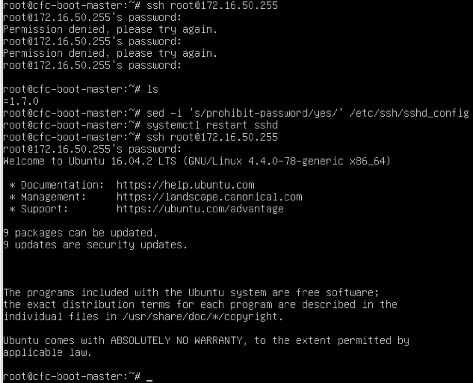
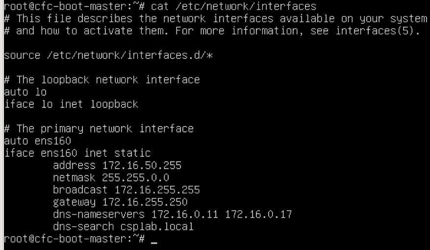
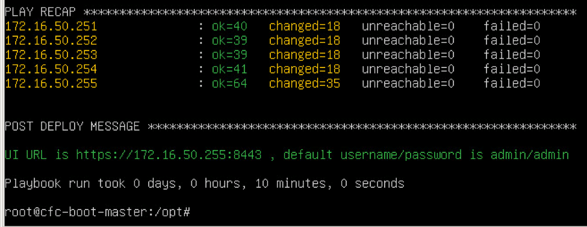
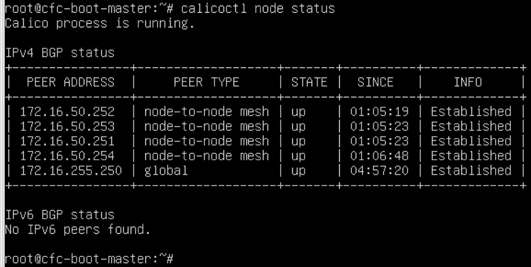
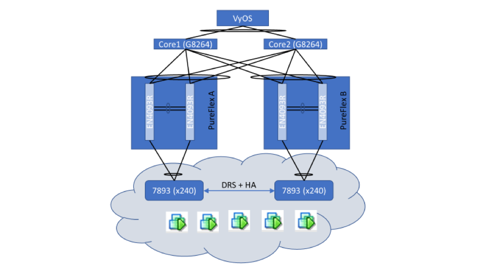

Install IBM Cloud private-ce
=============================================

Assumptions:
------------

1.  **Overprovisioning**: The way cloud services are designed to work is they only allocate as much resources to a virtual machine as is required for the current workload. Capacity is granted and removed as needed. For example, you may allocate 8 virtual CPUs to a VM, but that VM is actually only using the amount of GHz of processing power on the host machine as is needed to satisfy the demand.

    This means that whether you allocate 1 vCPU or 2 vCPUs, you are not using more capacity on the host to run the same workload.
    
    The same is the case for Memory. If you allocate 16GB of memory, but your VM is only using 2 GB of it, the host only allocates 2 GB.
    Studies indicate that the average dedicated server only uses about 10 – 20% of its available capacity. Because of this, a cloud service may overprovision the amount of CPU and RAM on a host by a factor of as much as 10 and still provide optimal responsiveness to VMs it hosts.
    
    To add additional CPU and Memory resources to a guest (virtual machine) it must be shutdown and resources re-allocated. For this reason, we will allocate ample CPU and Memory for our virtual machines knowing that we will only be using what we need at any given time and it is better to have too much than too little.
    
    Similarly, storage can normally be overprovisioned by a factor of 4 when all VMs are using thin provisioned disks. It is better to create a larger thinly provisioned disk than we think we may need than to create a smaller one and then have to come back later and increase the size or add additional disks to satisfy the need.
    
    If provisioning into a public cloud provider, this may not be the case depending on that providers billing model. If you are only charged for resources **used** then this model still works, but if you are billed for resources **allocated**, then you may want to make sure you request only what you need so you are not charged for resources you are not using.
    
    In this example we will use the former model and allocate ample resources so we do not have to come back later and add more.

2.  Installation will be performed on Ubuntu 16.04.2 LTS server amd64. All commands will be for this platform.

3.  Installation must be done as root. To reduce the number of keystrokes, we will login to the root account rather than running sudo in front of every command.

4.  For simple demo/test purposes, the entire environment can be installed onto a single node, but this is not suitable for any amount of test or production use. The Topology for this implementation will have a combined boot and master server plus a proxy server and three worker nodes.

    A short video tutorial for installing IBM Spectrum Conductor for Containers in a single node can be found on the developerWorks page at <https://www.ibm.com/developerworks/community/blogs/fe25b4ef-ea6a-4d86-a629-6f87ccf4649e/entry/Installing_your_cluster?lang=en>.

5.  **HA/DR:** In this tutorial, we will be installing onto a VMware cluster made up of two hosts with DRS, vMotion, and HA enabled. This will provide for host based HA for our environment

For more information on the high availability aspects of the infrastructure see Appendix B.

For DR, we are using Tivoli Storage Manager (TSM) Data Protection for VMware.  It is configured to take a backup snapshot nightly and store the snapshot which can then be restored at a later time in the event of catastrophic failure.

Installation
------------

1.  Install a single Ubuntu 16.04 Server amd 64 on a single Virtual Machine

> <http://releases.ubuntu.com/16.04/ubuntu-16.04.2-server-amd64.iso>
>
> CPUs: 4
> Memory: 8GB
> Disk: 100GB (Thin Provisioned)
>       **Note:** All application storage (PersistentVolume [PV] storage) is via NFS and is external to this environment. There is no need to allocate additional storage for PV storage here.
>
> Initially, configure the server for DHCP (if available). We will assign static IP’s later. If not available assign the static IP of your boot/master server here.

1. Enable root login remotely via ssh

    1. Set a password for the root user
        1. `sudo su -` \# provide your user password to get to the root shell
        2. `passwd` \# Set the root password
        

2.  Enable remote login as root
    1. `sed -i 's/prohibit-password/yes/' /etc/ssh/sshd_config`
    2. `systemctl restart ssh`

2.  Update NTP settings to make sure time stays in sync
    1.  `apt-get install -y ntp`
    2.  If using an internal NTP server, edit /etc/ntp.conf and add your internal server to the list and then restart the ntp server. In the following configuration, the server is configured to use a local NTP server (ntp.csplab.local) and fall back to public servers if that server is unavailable.

After making configuration changes restart the NTP server with the command:
 >`sytemctl retart ntp`

To test the status of your NTP servers, use the command:
>`ntpq -p`

1.  Update the vm.max\_map\_count setting to 262144:
    `sysctl -w vm.max_map_count=262144`
    
2. Make the changes permanent by adding the following line to the bottom of the /etc/sysctl.conf file:
    
    
3. To check the current value use the command:
 >   `sysctl vm.max_map_count`

2.  Install docker

    1. Update your ubuntu repositories
    
    >   `apt-get update`

    2.  Install Linux image extra packages
    
    >   `apt-get install -y linux-image-extra-$(uname -r) linux-image-extra-virtual`

    3.  Install the docker repositories
    
    >   `apt-get install -y apt-transport-https ca-certificates curl software-properties-common`

    4.  Add Docker’s official GPG key
    
        `curl -fsSL https://download.docker.com/linux/ubuntu/gpg | apt-key add -`

    5.  Verify that the key fingerprint is 9DC8 5822 9FC7 DD38 854A E2D8 8D81 803C 0EBF CD88
    
        `apt-key fingerprint 0EBFCD88`
        
    
    
    6.  Setup the docker stable repository
    
        `add-apt-repository "deb [arch=amd64] https://download.docker.com/linux/ubuntu $(lsb\_release -cs) stable"`

    7.  Install docker

        1.  `apt-get update`

        2.  `apt-get install -y docker-ce`

    8.  Makes sure docker is running

        1.  `docker run hello-world`

    9.  If this doesn’t work, you will need to do some troubleshooting.

3.  Install docker.py

    1.  `apt-get install -y python-setuptools`

    2.  `easy_install pip`

    3.  `pip install docker-py>=1.7.0`

4.  Shutdown your VM

    1.  `shutdown -h now`

5.  In the VMware vCenter Web Client convert this VM to a template. We will use this template to provision any additional nodes we need in the environment including additional worker nodes as needed.

    Create new VMs from your new template for each of the nodes in the cluster:

    1.  cfc-boot-master

    2.  cfc-proxy

    3.  cfc-worker1

    4.  cfc-worker2

    5.  cfc-worker3

6.  If your network interface is configured for DHCP, boot all of the newly provisioned nodes and then, using the VMware console, login to each VM and reconfigure the hostname and add the appropriate static IP address.

    If you do not have a dhcp server and configured the original VM with a static IP, you will need to boot each VM in turn configuring each with its new IP address before booting the next to prevent having duplicate IP addresses on your network.
    
    For each of your new VMs perform the following tasks to change the IP address and hostname of your servers.

    1.  Change the hostname
        Edit the file /etc/hostname with your favorite text editor (e.g. vim) and change the value to match the node: e.g. cfc-boot-master, cfc-proxy, cfc-worker1, cfc-worker2, and cfc-worker3, respectively.
        
        

    2.  Modify /etc/network/interfaces to configure a static IP address
        In our environment, we are using the IP addresses listed in the screenshot in step 2 above.
        
        

    3.  In ubuntu 16.04, resetting the network with the standard “systemctl restart networking” does not seem to change the IP address, rather it adds an additional IP address to the interface. Enabling the new IP will require a reboot.
    
        `shutdown -r now`

7.  You should now have all of your hosts prepared, named properly, and containing the proper IP addresses. The next step is to configure passwordless SSH between the boot-master node and the other nodes. You first need to create a passwordless SSH key that can be used across the implementation:

    1.  Login as to the boot-master node as root

    2.  From root’s home directory execute:
        `ssh-keygen -t rsa -P ''` \# Upper case P and two single quotes for no password
        
        Accept the default location of /root/.ssh/id\_rsa for the new key file
        
        Now, executing `ls .ssh` from root’s home directory should show three files: id_rsa, id_rsa.pub and known_hosts

    3.  Copy the resulting id_rsa key file to each node in the cluster (including the boot-master node on which we are currently operating).

        1.  Copy to the master node (to the current node):
            `ssh-copy-id -i .ssh/id_rsa root@cfc-proxy`  \# Remember, master and proxy are on the same node
            
            You will now find that there is a new file called "authorized_keys" in your .ssh folder which contains the contents of id_rsa.pub.

        2.  Repeat for each additional server:
        
            `ssh-copy-id -I .ssh/id_rsa root@cfc-worker1`
            
            `ssh-copy-id -I .ssh/id_rsa root@cfc-worker2`
            
            `ssh-copy-id -I .ssh/id_rsa root@cfc-worker3`
            

        3.  When this is complete you should be able to ssh from the boot-master node to each of the other nodes without having to provide a password. You can test this by executing:
        
            `ssh root@cfc-proxy`
            
            `ssh root@cfc-worker1`
            
            `ssh root@cfc-worker2`
            
            `ssh root@cfc-worker3`
            
            If you cannot gain access via SSH without a password, ensure that you have enabled root login on each VM and have modified /etc/ssh/sshd\_config on each VM to allow remote login.

8.  Your virtual machines are now ready to install CFC and now is a good time to take a snapshot of each VM in the cluster. In the event something goes wrong with the installation you can revert to this snapshot and try it again.[1]

9.  Next we need to download the cfc installer docker image.

    1.  On the boot-master node as the root user ensure your docker service is running:
        `systemctl status docker`
        
        

    2.  If the response shows that docker is not running you can start it with the command:
        `systemctl start docker`

    3.  If the status is failed you will need to troubleshot the docker installation before going forward.

    4.  Pull the cfc installer docker image:
    
        1.  `docker pull ibmcom/cfc-installer:1.2.0`
        
        

        2.  Change directory to /opt
        
            `cd /opt`
            
        3.  Extract the configuration files into the local directory under the ‘cluster’ subdirectory
        
            `docker run -e LICENSE=accept --rm -v "$(pwd)":/data ibmcom/cfc-installer:1.2.0 cp -r cluster /data`

10. Configure the cfc installer

    1.  Modify /opt/cluster/hosts to specify the IP addresses for the VMs in your cluster
    
    2.  Copy the id_rsa file created in step 11b over the /opt/cluster/ssh_key file and ensure its permissions are set to 400.
    
        `cp ~/.ssh/id_rsa /opt/cluster/ssh_key`
        
        `chmod 400 /opt/cluster/ssh_key`

    3.  Modify the /opt/cluster/conifg.yaml file to compliment your environment.

        1.  `mesos_enabled: false`

        2.  `install_docker_py: false` \# We already installed this in step 7

        3.  `network_type: calico`
        
            Calico networking uses BGP for routing. Enabling routing between an existing network infrastructure and the cfc cluster requires separate configuration. See Appendix A.

        4.  `network_cidr: 10.1.0.0/16`
        
            This value must be routable within your network so it cannot overlap any existing subnet.

        5.  `service_cluster_ip_range: 10.0.0.1/24`
        
            This value does not need to be routable, but should not conflict with the network\_cidr range or anything in your existing host network.
            
            (Interestingly, this subnet is the lowest possible subnet in the 10.x class A private IP range. The subnet starts with .1 because 10.0.0.0 is the subnet name and is not available for assignment.

        6.  `cluster_domain: cluster.local`
        
            This should be sufficient unless you have other clusters in your network. No two cluster\_domains can be the same.

        7.  None of the additional options should be modified

11. Deploy your environment. From the /opt/cluster directory execute:

    cd /opt/cluster
    
    `docker run -e LICENSE=accept --net=host --rm -t -v "$(pwd)":/installer/cluster ibmcom/cfc-installer:1.2.0 install`

12. About 10 minutes later you should have a deployed IBM Spectrum Conductor for Containers implementation.

    Note that it is normal to occasionally get a “FAILED” message on the screen. This is a process waiting for another process to become available and this only means that it was not available at this check and it will sleep for a time and retry.
    
    

    

    Login to your new implementation at <https://172.16.50.255>:8443 with userid of admin and password of admin.

Appendix A
==========

Access to cluster networks from outside the cluster.
----------------------------------------------------

IBM Spectrum Conductor for Containers was installed with calico networking. Calico runs a vRouter on each host in the cluster which manages routing for all applications and services running on that host. Calico uses BGP for internal routing, so in oder to reach services running on your cluster from outside networks you must configure your network to communicate with the calico network via BGP.

In the Cloud Adoption Lab, routing is performed by a VyOS router, so the following instructions describe how to configure a VyOS router to communicate with your cfc cluster. If you are using a different router the principles will be the same by the commands may be different.

It should also be noted that the BGP instructions for VyOS are skimpy at best. I am not sure if all the commands listed are strictly required, but it works when I use them as they are so I have not tried to test any kind of changes.

Extract the calicoctl command from docker:

    `docker run --rm -v /root:/data --entrypoint=cp ibmcom/calico-ctl:v1.2.1 /calicoctl /data`

Then move the file to a directory in your path:

Next, create a new resource file in your home directory called .calicorc with the following contents:

    `export ETCD_AUTHORITY=master.cfc:4001`
    `export ETCD_SCHEME=https`
    `export ETCD_CA_CERT_FILE=/etc/cfc/conf/etcd/ca.pem`
    `export ETCD_CERT_FILE=/etc/cfc/conf/etcd/client.pem`
    `export ETCD_KEY_FILE=/etc/cfc/conf/etcd/client-key.pem`

Then, include this file in your .bashrc file by adding the following line at the bottom:

    `. ~/.calicorc`

This will ensure that your calicoctl environment is setup correctly every time you login.  To set it up for use in the current shell, execute the following on the command line:

    `. ~/.calicorc`

You are now ready to execute calicoctl commands.

Before making any changes we will take a snapshot of our currently well-running ICP VMs as well as our VyOS router VM.

To configure BGP connectivity, your external router must configured for BGP sessions between the router and each calico-enabled host (e.g. icp-boot-master, icp-proxy, icp-worker1, icp-worker2, icp-worker3).

The ICP BGP AS (Autonomous System) number is 64511, by default.  You can check your AS number by running the command:

    `calicoctl config get asnumber`

If you need to change the BGP AS number of your installation (if this default AS conflicts with an existing BGP network or you have more than one ICP installation), you can do so with the following command:

    `calicoctl config set asnumber 64515`

Your master node will need to be configured for a BGP session with the router. All of the other BGP neighbors in the Calico AS will then route through the master node.

The gateway address of our VyOS router is 172.16.255.250 and that will be used as the peerIP for the BGP configuration on cfc-boot-master.

Create a file in the root home directory named ‘bgpPeer.yaml’ with the following contents:

    apiVersion: v1
    kind: bgpPeer
    metadata:
      peerIP: 172.16.255.250
      scope: global
    spec:
      asNumber: 65536

Note that the offset at the beginning of the lines under metadata and spec are spaces and not tabs.

Create an environment variable to define the prooper etcd endpoints[2]:

export ETCD\_ENDPOINTS=http://172.16.50.255:4001

Use the calicoctl utility to create the bgpPeer using the file you just created:

    `calicoctl create -f ~/bgpPeer.yaml`

&gt;&gt; Successfully created 1 ‘bgpPeer’ resource(s)

When you check the calico node status you will find that now one side of the bgpPeer connection is configured, but the other is not:

Now we have to configure the VyOS router for the other side of the BGP connection. Use the following commands to configure the router:

    set protocols bgp 65536 neighbor 172.16.50.255 ebgp-multihop '2'
    set protocols bgp 65536 neighbor 172.16.50.255 remote-as 64511
    set protocols bgp 65536 neighbor 172.16.50.255 update-source '172.16.255.250'
    set protocols bgp 65536 neighbor 172.16.50.255 description "cfc-boot-master"
    set protocols bgp 65536 neighbor 172.16.50.254 ebgp-multihop '2'
    set protocols bgp 65536 neighbor 172.16.50.254 remote-as '64511'
    set protocols bgp 65536 neighbor 172.16.50.254 update-source '172.16.255.250'
    set protocols bgp 65536 neighbor 172.16.50.254 description "cfc-proxy"
    set protocols bgp 65536 neighbor 172.16.50.253 ebgp-multihop '2'
    set protocols bgp 65536 neighbor 172.16.50.253 remote-as '64511'
    set protocols bgp 65536 neighbor 172.16.50.253 update-source '172.16.255.250'
    set protocols bgp 65536 neighbor 172.16.50.253 description "cfc-worker3"
    set protocols bgp 65536 neighbor 172.16.50.252 ebgp-multihop '2'
    set protocols bgp 65536 neighbor 172.16.50.252 remote-as '64511'
    set protocols bgp 65536 neighbor 172.16.50.252 update-source '172.16.255.250'
    set protocols bgp 65536 neighbor 172.16.50.252 description "cfc-worker2"
    set protocols bgp 65536 neighbor 172.16.50.251 ebgp-multihop '2'
    set protocols bgp 65536 neighbor 172.16.50.251 remote-as '64511'
    set protocols bgp 65536 neighbor 172.16.50.251 update-source '172.16.255.250'
    set protocols bgp 65536 neighbor 172.16.50.251 description "cfc-worker1"
    set protocols bgp 65536 network "10.2.0.0/16"
    set protocols bgp 65536 parameters router-id '172.16.255.250'
    set protocols static route 10.2.0.0/16 blackhole distance '254'
    commit
    save

Now the bgpPeer connection shows as established and you should be able to reach addresses on your Calico network (10.1.0.0/16 in our example.)

Appendix B
==========

High Availability
-----------------

Configuring high availability for the cluster is outside the scope of this document, but the following are things to consider for local High Availability configuration within the datacenter.

High Aviailability (HA) requires redundancy at all levels. This includes the data and SAN networks, compute nodes, virtualization, and servers.

The environment in this tutorial is running in a traditional computer lab with the following characteristics:

Compute

2 PureFlex Chassis

2 Compute Nodes (x240), one running in each chassis

Data Network

Each chassis has 2x 10GB EN4093R network switches

The chassis switches are configured with InterSwitch Links (ISLs).

Each switch has two vLAG/LACP links to two redundant core switches providing a total of 40GB total bandwidth to the core.

Two core switches are also configured with ISLs providing a total of 40GB total bandwidth and full redundancy at the core.

SAN Network

Each chassis also has 2x Brocade FC5022 8/16G Fiber Switches connected to two core SAN Switches (Fabric A and Fabric B). Storage is provided via v7000 SVC with internal mechanical and SSD disks as well as external FlashStorage 820 appliances providing flash storage as external disks.

Volumes provided to the CFC cluster are made up of mechanical, SSD, and Flash storage with EasyTier enabled.

A single thinly provisioned SAN volume is exposed to both compute nodes in the VMware cluster such that vMotion, HA, and DRS can be enabled.
 
With this configuration, all resources are fully redundant and highly available within the datacenter.

For DR purposes, a second datacenter (or more) with similar characteristics would need to be available. For the highest level of HA/DR, the environment would be spread across a hybrid environment made up of on-premises resources (such as is defined in this tutorial), and public/dedicated cloud environments from two or more cloud service providers.

In this scenario, resources would be available regardless of the availability of any of the three cloud service providers. This would require site-to-site VPN connections between the on-prem resources and any cloud service providers to allow for direct network connectivtiy between all resources.

Redundancy of the cluster itself is discussed in a separate document.

Appendix C
==========

Useful Links
------------

Full instllation Instructions: <https://www.ibm.com/support/knowledgecenter/SS8TQM_1.1.0/installing/install_containers.html>

Hardware Requirements: <https://www.ibm.com/support/knowledgecenter/SS8TQM_1.1.0/supported_system_config/hardware_reqs.html>

Preparing VMs for deployment: <https://www.ibm.com/support/knowledgecenter/SS8TQM_1.1.0/installing/prep_cluster.html#task_rl4_knc_ww>

ENDNOTES

[1] It should also be noted that snapshots take up a lot of space and each new snapshot is a delta of changes since the last snapshot or initial version. The more snapshots you have the more disk space you use and the less efficient and performant your implementation will be.

Since we are at a good stage now to which we may want to revert in the future if something goes wrong, it is also not a bad idea to remove any previous interim snapshots you may have taken. As a general rule, the fewer the number of snapshots the better.
